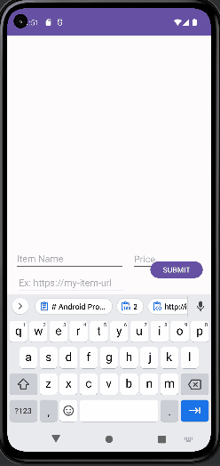

# Android Project 2 - *Wishlist*

Submitted by: **Siraj Mughal**

**Wishlist** is a wishlist app that helps the user keep track of what they want to buy.

Time spent: **2** hours spent in total

## Required Features

The following **required** functionality is completed:

- [✅] **User can add an item to their wishlist**
- [✅] **User can see their list of items based on previously inputted items**

## Video Walkthrough

Here's a walkthrough of implemented user stories:

GIF created with ...  
[ScreenToGif](https://www.screentogif.com/) for Windows
